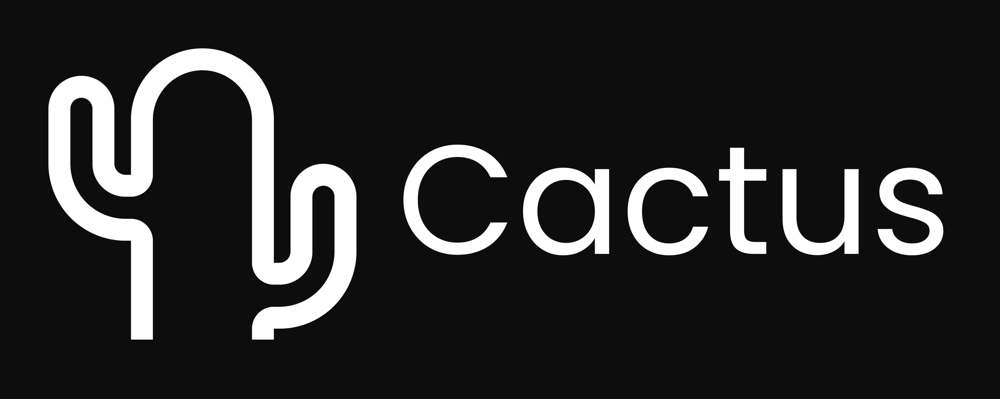

<span>
  
  
  
</span>

Cross-platform framework for deploying LLM/VLM/TTS models locally in your app.

- Available in Flutter, React-Native and Kotlin Multiplatform.
- Supports any GGUF model you can find on Huggingface; Qwen, Gemma, Llama, DeepSeek etc.
- Run LLMs, VLMs, Embedding Models, TTS models and more.
- Accommodates from FP32 to as low as 2-bit quantized models, for efficiency and less device strain.
- Chat templates with Jinja2 support and token streaming.


Get started with an [example app](https://github.com/cactus-compute/example-react-agents/) built using `CactusAgent`.

See the [React Docs](https://github.com/cactus-compute/cactus/blob/main/react) for more.

## 

1.  **Add Maven Dependency:**
    Add to your KMP project's `build.gradle.kts`:
    ```kotlin
    kotlin {
        sourceSets {
            commonMain {
                dependencies {
                    implementation("com.cactus:library:0.2.4")
                }
            }
        }
    }
    ```

2. **Platform Setup:**
    - **Android:** Works automatically - native libraries included.
    - **iOS:** In Xcode: File → Add Package Dependencies → Paste `https://github.com/cactus-compute/cactus` → Click Add

3. **Kotlin Multiplatform Text Completion**
    ```kotlin
    import com.cactus.CactusLM
    import kotlinx.coroutines.runBlocking

    runBlocking {
        val lm = CactusLM(
            threads = 4,
            contextSize = 2048,
            gpuLayers = 0 // Set to 99 for full GPU offload
        )

        val downloadSuccess = lm.download(
            url = "path/to/hugginface/gguf",
            filename = "model_filename.gguf"
        )
        val initSuccess = lm.init("qwen3-600m.gguf")

        val result = lm.completion(
            prompt = "Hello!",
            maxTokens = 100,
            temperature = 0.7f
        )
    }
    ```

4. **Kotlin Multiplatform Speech To Text**
    ```kotlin
    import com.cactus.CactusSTT
    import kotlinx.coroutines.runBlocking

    runBlocking {
        val stt = CactusSTT(
            language = "en-US",
            sampleRate = 16000,
            maxDuration = 30
        )

        // Only supports default Vosk STT model for Android & Apple FOundation Model
        val downloadSuccess = stt.download()
        val initSuccess = stt.init()

        val result = stt.transcribe()
        result?.let { sttResult ->
            println("Transcribed: ${sttResult.text}")
            println("Confidence: ${sttResult.confidence}")
        }

        // Or transcribe from audio file
        val fileResult = stt.transcribeFile("/path/to/audio.wav")
    }
    ```

5. **Kotlin Multiplatform VLM**
    ```kotlin
    import com.cactus.CactusVLM
    import kotlinx.coroutines.runBlocking

    runBlocking {
        val vlm = CactusVLM(
            threads = 4,
            contextSize = 2048,
            gpuLayers = 0 // Set to 99 for full GPU offload
        )

        val downloadSuccess = vlm.download(
            modelUrl = "path/to/hugginface/gguf",
            mmprojUrl = "path/to/hugginface/mmproj/gguf",
            modelFilename = "model_filename.gguf",
            mmprojFilename = "mmproj_filename.gguf"
        )
        val initSuccess = vlm.init("smolvlm2-500m.gguf", "mmproj-smolvlm2-500m.gguf")

        val result = vlm.completion(
            prompt = "Describe this image",
            imagePath = "/path/to/image.jpg",
            maxTokens = 200,
            temperature = 0.3f
        )
    }
    ```

  N/B: See the [Kotlin Docs](https://github.com/cactus-compute/cactus/blob/main/kotlin) for more.

## 

Cactus backend is written in C/C++ and can run directly on phones, smart tvs, watches, speakers, cameras, laptops etc. See the [C++ Docs](https://github.com/cactus-compute/cactus/blob/main/cpp) for more.


## 

3. **Kotlin Multiplatform**
    - Build the Android JNILibs with `scripts/build-flutter-android.sh`. (Flutter & Kotlin share same JNILibs)
    - Build the Kotlin library with `scripts/build-kotlin.sh`. (MUST run before using example)
    - Navigate to the example app with `cd kotlin/example`.
    - Open your simulator via Xcode or Android Studio, [walkthrough](https://medium.com/@daspinola/setting-up-android-and-ios-emulators-22d82494deda) if you have not done this before.
    - Always start app with `./gradlew :composeApp:run` for desktop or use Android Studio/Xcode for mobile.
    - Play with the app, and make changes either to the example app or library as desired.

4. **C/C++**
    - Navigate to the example app with `cd cactus/example`.
    - There are multiple main files `main_vlm, main_llm, main_embed, main_tts`.
    - Build both the libraries and executable using `build.sh`.
    - Run with one of the executables `./cactus_vlm`, `./cactus_llm`, `./cactus_embed`, `./cactus_tts`.
    - Try different models and make changes as desired.
