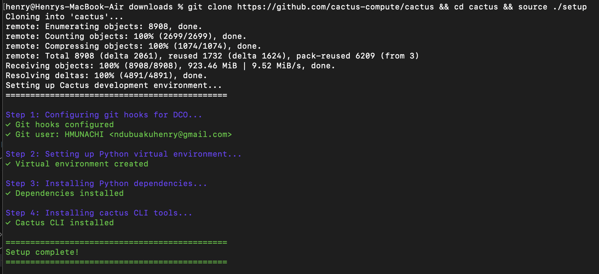
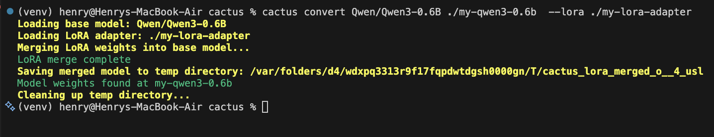
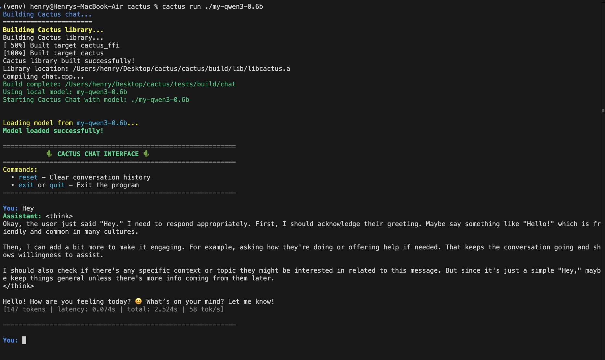
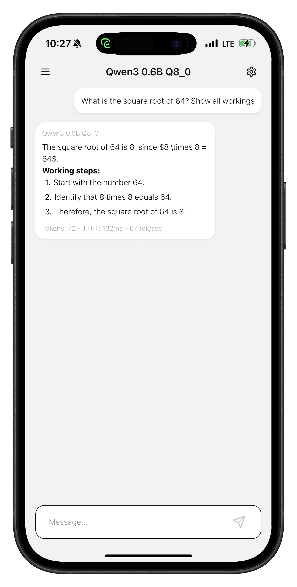

# Deploying Unsloth Fine-Tunes to Cactus for Phones

- Cactus is an inference engine for mobile devices, Macs, and ARM chips like Raspberry Pi.
- At INT8, Cactus runs `Qwen3-0.6B` and `LFM2-1.2B` at `60-70 toks/sec` on iPhone 17 Pro, `13-18 toks/sec` on budget Pixel 6a.
- INT4 quantization provides ~50% memory reduction with minimal quality loss.
- Task-Specific INT8 tunes of `Gemma3-270m` hit `150 toks/sec` on iPhone 17 Pro and `23 toks/sec` on Raspberry Pi 5. 

## Quick Start

### 1. Train (Google Colab / GPU)

Use the provided notebook or your own Unsloth training script:

```python
from unsloth import FastLanguageModel

model, tokenizer = FastLanguageModel.from_pretrained(
    model_name="unsloth/gemma-3-4b-it",
    max_seq_length=2048,
    load_in_4bit=True,
)

model = FastLanguageModel.get_peft_model(
    model,
    r=16,
    target_modules=["q_proj", "k_proj", "v_proj", "o_proj",
                    "gate_proj", "up_proj", "down_proj"],
    lora_alpha=16,
    lora_dropout=0,
    use_gradient_checkpointing="unsloth",
)

# ... train with SFTTrainer ...

# Save adapter
model.save_pretrained("my-lora-adapter")
tokenizer.save_pretrained("my-lora-adapter")

# Push to Hub (optional)
model.push_to_hub("username/my-lora-adapter")
```

### 2. Setup Cactus

```bash
git clone https://github.com/cactus-compute/cactus && cd cactus && source ./setup
```


### 3. Convert for Cactus

```bash
# From local adapter: Use the correct base model!
cactus convert Qwen/Qwen3-0.6B ./my-qwen3-0.6b --lora ./my-lora-adapter 

# From HuggingFace Hub: Use the correct base model!
cactus convert Qwen/Qwen3-0.6B ./my-qwen3-0.6b --lora username/my-lora-adapter 

```


### 4. Run

```bash
cactus run ./my-qwen3-0.6b
```

`cactus run` accepts the bundle path directly, or auto-builds from a HF model id
when no bundle exists locally.


### 5. Use in iOS/macOS App

Build the native library:

```bash
cactus build --apple
```
```
Build complete!
Total time: 58 seconds
Static libraries:
  Device: <repo>/apple/libcactus_engine-device.a
  Simulator: <repo>/apple/libcactus_engine-simulator.a
XCFrameworks:
  iOS: <repo>/apple/cactus-ios.xcframework
  macOS: <repo>/apple/cactus-macos.xcframework
Building Cactus for Apple platforms complete!
```

Link `cactus-ios.xcframework` to your Xcode project, then:

```swift
import Foundation
import cactus  // module map → cactus_engine.h

let modelPath = Bundle.main.path(forResource: "my-model", ofType: nil)!
let model = cactus_init(modelPath, nil, false)

let messages = "[{\"role\":\"user\",\"content\":\"Hello!\"}]"
var buf = [Int8](repeating: 0, count: 65536)
buf.withUnsafeMutableBufferPointer { ptr in
    _ = cactus_complete(model, messages, ptr.baseAddress, ptr.count,
                        nil, nil, nil, nil, nil, 0)
}
let resultJson = String(cString: buf)
if let data = resultJson.data(using: .utf8),
   let obj = try? JSONSerialization.jsonObject(with: data) as? [String: Any],
   let response = obj["response"] as? String {
    print(response)
}

cactus_destroy(model)
```


You can now build iOS apps using the following code, 
but to see performance on any device while testing,
run cactus tests by plugging any iPhone to your Mac then running:

```bash
cactus test --model <model-path-or-name> --transcription-model <model-path-or-name> --ios
```

Cactus demo apps will eventually expand to using your custom fine-tunes.
Also, `cactus run` will allow plugging in a phone,
such that the interactive session uses the phone chips,
this way you can test before fully building out your apps.

### 6. Use in Android App

Build the native library:

```bash
cactus build --android
```
```
Build complete!
Shared library location: <repo>/android/libcactus_engine.so
Static library location: <repo>/android/libcactus_engine.a
Building Cactus for Android complete!
```

Copy `libcactus_engine.so` to `app/src/main/jniLibs/arm64-v8a/`, then:

```kotlin
import com.cactus.*
import org.json.JSONObject

val model = cactusInit("/data/local/tmp/my-model", null, false)

val resultJson = cactusComplete(
    model,
    """[{"role":"user","content":"Hello!"}]""",
    null,   // optionsJson
    null,   // toolsJson
    null,   // callback
    null,   // pcmData
)
val response = JSONObject(resultJson).getString("response")
println(response)
cactusDestroy(model)
```

You can now build Android apps using the following code, 
but to see performance on any device while testing,
run cactus tests by plugging any Android phone to your Mac then running:

```bash
cactus test --model <model-path-or-name> --transcription-model <model-path-or-name> --android
```

Cactus demo apps will eventually expand to using your custom fine-tunes.
Also, `cactus run` will allow plugging in a phone,
such that the interactive session uses the phone chips,
this way you can test before fully building out your apps.

## Resources

- Supported Base Models: `Qwen3, Qwen3.5, Gemma3, LFM2, LFM2.5`
- Full API reference: [Cactus Engine](https://github.com/cactus-compute/cactus/blob/main/docs/cactus_engine.md)
- Learn more and report bugs: [Cactus](https://github.com/cactus-compute/cactus/tree/main)

## See Also

- [Cactus Engine API](/docs/cactus_engine.md) — Full C API reference for inference, streaming, and tool calling
- [Runtime Compatibility](/docs/compatibility.md) — Ensure your weights match your Cactus runtime version
- [Python Binding](/python/) — Use fine-tuned models from Python
- [Swift Binding](/bindings/swift/) — Deploy fine-tuned models in iOS/macOS apps
- [Kotlin Binding](/bindings/kotlin/) — Deploy fine-tuned models in Android apps
